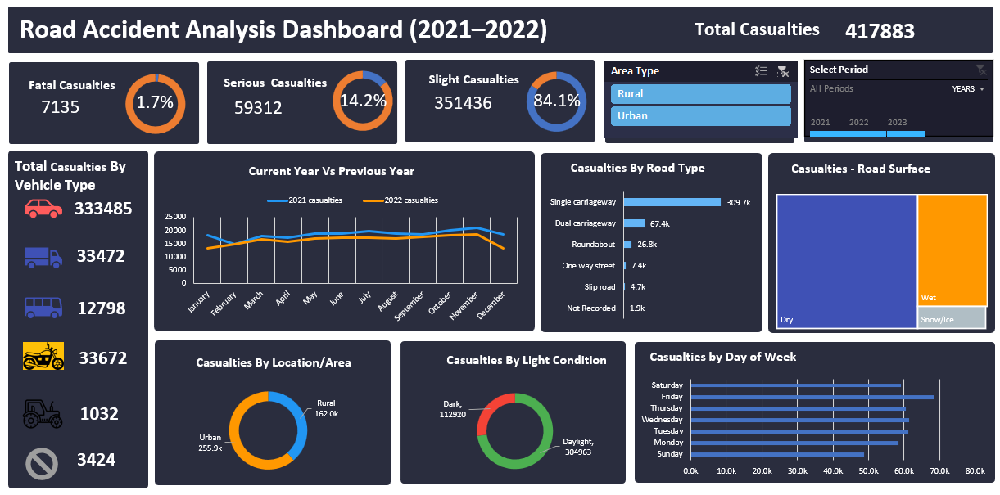

# Road Accident Analysis Dashboard (2021–2022)

## Project Overview
Built an interactive Excel dashboard to analyze road accident data and identify casualty trends by road type, vehicle type, location, and time period.

## Features
- Total Casualties Analysis
- Severity Breakdown (Fatal, Serious, Slight)
- Vehicle Type Analysis
- Road Type & Road Surface Analysis
- Urban vs Rural Comparison
- Monthly Trend Analysis
- Interactive Slicers

## Key Insights
- Total casualties: 417,883
- 84.1% were slight casualties
- Most accidents occurred on single carriageways
- Dry roads recorded the highest accident count

## Tools Used
- Microsoft Excel
- Pivot Tables
- Pivot Charts
- Slicers
- Dashboard Design

## Key Skills
- Data Cleaning
- Pivot Tables
- Pivot Charts
- Dashboard Design
- Data Visualization
- Business Insights

## Files Included
- [Dashboard File](Road_Accident_Data.xlsx)
- Full Dataset: https://docs.google.com/spreadsheets/d/1a0N_G0bNHJReJllAGPiVm6PvVYt95p2t/edit?usp=drive_link

## Dashboard Preview

